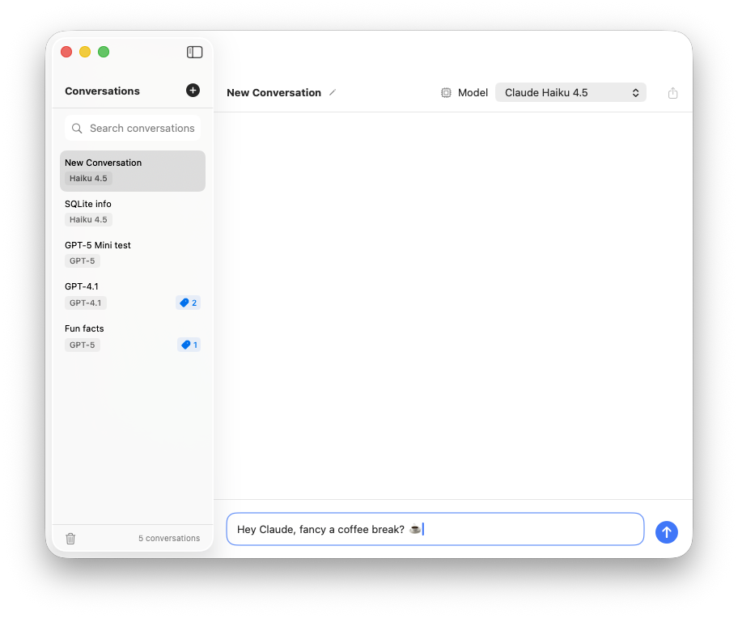

# Anchor

<p align="center">
  
</p>

⚓ A native macOS chat client for GitHub Copilot, providing a ChatGPT-like experience powered by the GitHub Copilot SDK.

## Overview

Anchor is a desktop application that lets you interact with Large Language Models through a familiar chat interface. It consists of:

- **SwiftUI Frontend** — Native macOS chat interface
- **Node.js Backend** — LLM SDK integration service  
- **SQLite Storage** — Local conversation persistence

## Features

- 💬 ChatGPT-like chat interface
- 🔄 Real-time streaming responses
- 📝 Markdown rendering with syntax highlighting
- 💾 Local conversation storage
- 🔀 Multiple model support
- 🏷️ Conversation tagging and organization
- 🔍 Search by title or tags
- 📋 Copy messages to clipboard
- 📎 Attachments (PDF, text, images)
- ⌨️ Keyboard shortcuts

----

<p align="center">
  
</p>

----

## Prerequisites

- macOS 14.0+ (Sonoma)
- **Node.js 20.x LTS** (required - see [Node.js Setup](#nodejs-setup) below)
- Xcode Command Line Tools (for frontend development; full Xcode optional)
- GitHub Copilot CLI (`@github/copilot`) - installed via npm
- Active Copilot subscription (Individual, Business, or Enterprise)

### Node.js Setup

> ⚠️ **IMPORTANT**: This project requires **Node.js v20.x** for both development and building. The bundled app embeds Node.js v20.20.0, and native modules (like `better-sqlite3`) must be compiled with a matching version.

**Using NVM (Recommended):**

```bash
# Install NVM if you haven't already
curl -o- https://raw.githubusercontent.com/nvm-sh/nvm/v0.40.0/install.sh | bash

# Install and use Node.js 20
nvm install 20.20.0
nvm use 20.20.0

# Set as default (optional)
nvm alias default 20.20.0
```

The project includes a `.nvmrc` file, so you can simply run:
```bash
cd Anchor
nvm use  # Automatically uses the version specified in .nvmrc
```

### GitHub Copilot CLI Setup

The Copilot CLI must be installed and authenticated:

```bash
# Install Copilot CLI globally
npm install -g @github/copilot

# Authenticate with GitHub
copilot auth login

# Verify installation
copilot --version  # Should show 0.0.400 or later
```

> **Note**: The Copilot CLI version must be **0.0.400 or later** to support SDK protocol version 2.

## Quick Start

### 1. Start the Backend

```bash
cd backend

# Ensure you're using Node.js 20 (run this before npm install/test/build)
nvm use

# Install dependencies
npm install

# Start the server
npm run dev
```

The backend will be available at:
- HTTP: http://localhost:3848 (development)
- WebSocket: ws://localhost:3848/ws (development)
- HTTP: http://localhost:3847 (prod)
- WebSocket: ws://localhost:3847/ws (prod)

### 2. Build and Run the Frontend

```bash
cd frontend

# Build and run
swift run
```

Or open in Xcode (optional):
```bash
cd frontend
swift package generate-xcodeproj
open Anchor.xcodeproj
```

## Project Structure

```
Anchor/
├── backend/                 # Node.js backend service
│   ├── src/
│   │   ├── index.ts        # Entry point
│   │   ├── server.ts       # HTTP/WS server
│   │   ├── routes/         # API routes
│   │   ├── services/       # Business logic
│   │   ├── websocket/      # WebSocket handlers
│   │   └── types/          # TypeScript types
│   └── package.json
│
├── frontend/                # SwiftUI macOS app
│   ├── Sources/
│   │   ├── AnchorApp.swift # App entry point
│   │   ├── Models/         # Data models
│   │   ├── Services/       # Network services
│   │   └── Views/          # SwiftUI views
│   └── Package.swift
│
└── README.md
```

## API Endpoints

| Method | Endpoint | Description |
|--------|----------|-------------|
| GET | `/api/health` | Health check |
| GET | `/api/auth/status` | Authentication status |
| GET | `/api/models` | List available models |
| GET | `/api/agents` | List available agents |
| GET | `/api/conversations` | List conversations |
| POST | `/api/conversations` | Create conversation |
| GET | `/api/conversations/:id` | Get conversation |
| PUT | `/api/conversations/:id` | Update conversation |
| DELETE | `/api/conversations/:id` | Delete conversation |
| DELETE | `/api/conversations` | Delete all conversations |
| POST | `/api/conversations/:id/tags` | Add tag to conversation |
| DELETE | `/api/conversations/:id/tags/:tagId` | Remove tag from conversation |
| GET | `/api/conversations/:id/messages` | Get messages |
| POST | `/api/conversations/:id/messages` | Send message |
| POST | `/api/conversations/:id/messages/:messageId/retry` | Retry failed message |
| POST | `/api/attachments` | Upload attachment |
| PUT | `/api/attachments/:id` | Rename attachment |
| DELETE | `/api/attachments/:id` | Delete attachment |

## WebSocket Events

| Event | Direction | Description |
|-------|-----------|-------------|
| `session:idle` | Server → Client | Connection confirmed, session ready |
| `message:start` | Server → Client | Streaming started |
| `message:delta` | Server → Client | Token received |
| `message:complete` | Server → Client | Response complete |
| `message:error` | Server → Client | Error occurred |
| `pong` | Server → Client | Response to client ping |
| `ping` | Client → Server | Keep-alive ping (JSON format) |

## Development

### Backend Development

```bash
cd backend
nvm use          # Ensure correct Node.js version!
npm run dev      # Start with hot reload
npm run build    # Build for production
npm run lint     # Run linter
```

### Frontend Development

```bash
cd frontend
swift build      # Build
swift run        # Run
swift test \
  -Xswiftc -F -Xswiftc "/Library/Developer/CommandLineTools/Library/Developer/Frameworks" \
  -Xlinker -rpath -Xlinker "/Library/Developer/CommandLineTools/Library/Developer/Frameworks" \
  -Xlinker -rpath -Xlinker "/Library/Developer/CommandLineTools/Library/Developer/usr/lib"
```

## Architecture

```
┌─────────────────────────────────────────────────────────────────────┐
│                        macOS Application                            │
│                                                                     │
│  ┌───────────────────────────┐    ┌──────────────────────────────┐  │
│  │     SwiftUI Frontend      │    │      Node.js Backend         │  │
│  │                           │    │                              │  │
│  │  • Chat Interface         │◄──►│  • GH Copilot SDK            │  │
│  │  • Conversation List      │HTTP│  • Session Management        │  │
│  │  • Model Selection        │ /  │  • Message Streaming         │  │
│  │  • Message Rendering      │ WS │  • Error Handling            │  │
│  │                           │    │                              │  │
│  └───────────────────────────┘    └──────────────────────────────┘  │
│              │                               │                      │
│              │                               ▼                      │
│              │                    ┌───────────────────────┐         │
│              │                    │   GitHub Copilot CLI  │         │
│              │                    │   (Authenticated)     │         │
│              ▼                    └───────────────────────┘         │
│  ┌───────────────────────────┐                                      │
│  │     SQLite Database       │                                      │
│  │  • Conversations          │                                      │
│  │  • Messages               │                                      │
│  │  • Tags                   │                                      │
│  └───────────────────────────┘                                      │
└─────────────────────────────────────────────────────────────────────┘
```

## Future Development Areas

- [ ] OCR support for image attachments
- [ ] CI/CD for Auto-release mechanism

## License

MIT
